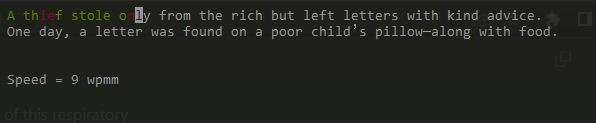
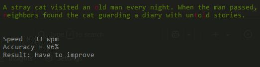

# typing-speed-and-accuracy-test

A fun and interactive terminal-based typing speed and accuracy test game built using Python's `curses` module for terminal UI and `pygame` for sound effects.

## Features
* Random short stories for typing
* Real-time feedback with color:
    * Green for correct characters
    * Red for mistakes
    * Black on white background for upcoming text
* Live Words Per Minute (WPM) tracking
* Accuracy calculation
* Sound effects for typing and mistakes
* Final result rating: Best, Better, Good, or Needs Improvement

## Evaluation System
* WPM is calculated based on standard formula.
* Accuracy is shown as a percentage.
* Performance is rated as:
    * Best! — 100% accuracy and WPM >= 50
    * Better! — 96-99% accuracy and WPM >= 40
    * Good! — 96-99% accuracy and WPM >= 35
    * Have to improve — Below the above thresholds

## UI Interface
### running mode

### output

## Requirements
* Python 3.x
* pygame module
#### Install pygame:
      pip install pygame
## ▶️ How to Run
      python filename.py
Note: make sure you are in the same directory of this respiratory

## How to Play
1. The game will display a short paragraph.
2. Start typing exactly as shown.
3. Get real-time visual and sound feedback.
4. Once done, see your typing speed and accuracy.

## Code Highlights
* Uses `curses` for terminal-based colored UI.
* Uses `pygame.mixer` for playing sound effects.
* Calculates WPM using formula: `wpm = (correct_chars / 5) / (time_in_minutes)`.
* Evaluates Accuracy and prints it with a result label.

## Customization
You can add more stories inside the `code_list` in the format:

          code_list = [
              """Your custom story here.""",
              # Add more stories
          ]
## License
This project is open-source and free to use for learning and personal projects.

#### Built with using `Python`, `Curses`, and `Pygame`
      
